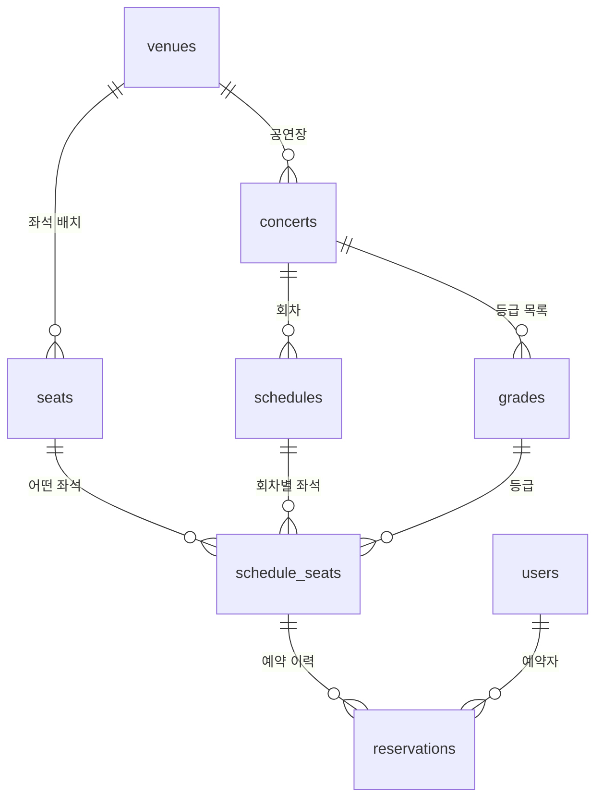

# Step 1. ERD

> 진행 중 · 큰 구조를 정하는 문답(Q1~Q3)을 마쳤다. 다음은 테이블을 하나씩 같이 설계한다.

## Q1. 좌석 상태는 어느 테이블에 두고, 테이블을 어떻게 나눌까?

**내 답**: 공연 테이블과 좌석 예매 테이블로 나눈다. 예매 데이터가 들어오면 좌석 예매 테이블에 행을 INSERT하고, 거기서 좌석 상태를 관리한다.

**피드백**: 잘 안 바뀌는 정보(공연)와 계속 바뀌는 정보(예매)를 나눈 방향은 맞다. 빠진 것이 두 가지 있다.

1. **회차**: 공연 하나에 회차가 여러 개다(12/24 19시, 12/25 18시). 좌석 상태는 공연이 아니라 회차에 묶인다.
2. **좌석 자체와 좌석 상태의 분리**: "A구역 3열 7번, VIP"는 공연장에 고정된 정보라 어느 회차든 같다. 반면 "예매 가능 / 점유 / 판매"는 회차마다 다르고 계속 바뀐다. 한 테이블에 섞으면 좌석 정보가 회차 수만큼 복제되고, 좌석 배치를 고칠 때 모든 회차를 고쳐야 한다.

그리고 Q1의 "예매할 때 INSERT"와 Q2의 "미리 만들어 둔다"가 서로 부딪힌다. 상태와 예매 기록을 다른 테이블로 나누면 풀린다. 상태는 미리 만들고, 예매 기록은 예매할 때 INSERT한다.

> 원칙: **변경 빈도와 생명주기가 다른 데이터는 테이블을 나눈다.**

## Q2. 회차별 좌석 행을 미리 만들까, 예약할 때 INSERT 할까?

**내 답**: 미리 만들어 두는 게 좋다. 1,000명이 같이 눌러도 조회와 업데이트를 한 번에 하는 쿼리로 예매를 관리해야 중복 예약 문제가 사라질 것 같다.

**피드백**: 정답. 이유를 하나 더 붙이면 **"잠글 대상이 존재해야 한다"**는 점이다.

- **미리 생성**: 100명이 같은 행 하나를 두고 경쟁한다. 그래서 행 락, 조건부 UPDATE, 버전 비교 같은 전략을 모두 쓸 수 있다.
- **예약할 때 INSERT**: 아직 없는 행은 잠글 수 없다. 막을 수단이 유니크 제약 하나뿐이고, "남은 좌석"을 보려면 매번 "전체 좌석 − 예약된 좌석"을 계산해야 한다.
- **비용**: 1,000석 × 회차 수. 회차가 10개여도 1만 행이라 DB에는 부담이 없다.

"조회와 업데이트를 한 번에 하는 쿼리"는 **조건부 UPDATE**(`UPDATE … WHERE id = ? AND status = 'AVAILABLE'`)라고 부른다. 뒤 단계에서 다른 전략과 비교한다.

## Q3. 좌석 상태와 예약 내역이 어긋나면 어느 쪽이 진실인가? 둘 다 필요한가?

**내 답**: 예약 내역을 진실로 봐야 한다. 놓칠 수 있는 중복 예약 버그가 생길 수 있으니 안전책으로 둘 다 필요하다.

**피드백**: 예약 내역(돈과 소유권의 기록)을 진실로 보는 건 맞다. 하지만 "안전책으로 둘 다"는 아니다. 같은 정보를 두 군데 두는 것 자체는 안전장치가 아니라 **어긋날 위험**을 만든다. 둘 다 두는 이유는 **역할이 달라서**다.

- **회차별 좌석 상태**: 지금 상태. 좌석맵 조회와 동시성 경합이 일어나는 곳.
- **예약 내역**: 이력. 취소 · 만료돼도 남고, 한 좌석에 여러 건 쌓일 수 있다(취소 후 재판매).

어긋나지 않게 하는 진짜 장치는 두 가지다.

1. **같은 트랜잭션**: 좌석 상태 변경과 예약 INSERT를 한 트랜잭션으로 묶는다. 둘 다 되거나 둘 다 안 된다(원자성).
2. **제약조건(방어선)**: "한 좌석에 활성 예약은 하나만"이라는 제약을 DB에 건다. 말한 "안전책"의 정확한 형태가 이것이다. 애플리케이션에 버그가 있어도 DB가 거부한다.

## 현재 구조

문답이 진행되면서 갱신한다. (Q25까지 반영) 시각화 화면의 ERD는 이 블록의 관계와 실제 DB 카탈로그를 합쳐서 그린다.



| 테이블 | 성격 | 담는 것 |
|---|---|---|
| `venues`, `seats` | 정적 | 공연장과 좌석 배치 |
| `concerts`, `schedules` | 정적 | 공연과 회차, 회차별 예매 오픈 시각 (Q23) |
| `grades` | 참조 | 공연별 등급과 등급별 표시 정보 (어드민이 관리, Q25) |
| `schedule_seats` | 동적 | 회차별 좌석의 등급과 상태 |
| `reservations` | 이력 | 누가 · 언제 · 어떤 좌석을 |

컬럼, 타입, 제약조건은 아래 문답에서 한 테이블씩 같이 정한다.

## 테이블 설계 문답

### seats (공연장 좌석)

#### Q4. "A구역 3열 7번, VIP" 좌석 하나를 저장하려면 어떤 컬럼과 타입이 필요할까?

**내 답**: `id`(PK), `section`(VARCHAR), `row_no`(INTEGER), `seat_no`(INTEGER), `grade`(VARCHAR)

**피드백**

- **좋은 점**: 열과 번호를 정수 컬럼으로 나눴다. `'A-3-7'` 같은 문자열 하나로 저장하면 정렬이 깨지고(문자열 비교로는 `'10' < '2'`), "1~3열" 같은 범위 조회와 좌석맵 그리기가 어려워진다.
- **빠진 것: 어느 공연장의 좌석인가.** "A구역 3열 7번"은 공연장마다 있다. `venues`와 연결하는 `venue_id`(FK)가 필요하다.
- **NOT NULL**: 구역이나 번호가 없는 좌석은 존재할 수 없다. PostgreSQL은 따로 적지 않으면 NULL을 허용하므로 모든 컬럼에 `NOT NULL`을 명시한다.
- **`grade`를 VARCHAR로만 두면** `'VIP'`, `'vip'`, `'VVIP'`, 오타까지 전부 들어간다. 다음 질문에서 다룬다.

**정리**

- 내 답으로 정한 것: `id`, `section`, `row_no`, `seat_no`, `grade`
- 피드백 제안 → Q5에서 이견 없음으로 합의: `venue_id` 추가, 모든 컬럼 NOT NULL

#### Q5. `grade`에 VIP · R · S만 들어가게 하려면 어디서, 어떻게 막을까?

**내 답**: 애플리케이션 코드에서 ENUM으로 지정해서 막는다. DB에서 막는 방법은 모르겠다.

**피드백**: 애플리케이션 검증은 꼭 필요하다. 사용자에게 친절한 에러를 바로 돌려줄 수 있고, 타입으로 실수를 줄여 준다. 하지만 **그것만으로는 부족하다.** DB에 데이터를 넣는 길이 애플리케이션 하나가 아니기 때문이다.

- 시드 스크립트, 배치 작업, 다른 서비스
- 운영 중에 사람이 직접 실행하는 SQL
- 검증 코드가 빠지거나 바뀐 옛 버전 · 새 버전 애플리케이션

데이터는 코드보다 오래 산다. 그래서 **애플리케이션은 친절한 1차 검사, DB는 마지막 보증**으로 둘 다 둔다. Q3의 "방어선"과 같은 생각이다.

DB에서 값을 제한하는 방법은 세 가지다.

| 방법 | 모양 | 장점 | 단점 |
|---|---|---|---|
| CHECK 제약 | `grade VARCHAR NOT NULL CHECK (grade IN ('VIP', 'R', 'S'))` | 가장 단순하다 | 값을 바꾸려면 제약을 지우고 다시 만들어야 한다 |
| ENUM 타입 | `CREATE TYPE seat_grade AS ENUM ('VIP', 'R', 'S')` | 저장 공간이 작고 값의 순서가 있다 | 값 추가는 쉽지만 삭제는 타입을 새로 만들어야 할 만큼 어렵다 |
| 참조 테이블 | `grades(code PK, name, …)` + `seats.grade`가 FK로 참조 | 값을 데이터로 관리한다(스키마 변경 없이 추가). 등급별 부가 정보를 담을 수 있다 | 테이블이 하나 늘고, 부가 정보를 보려면 JOIN이 필요하다 |

**정리**

- 합의: 애플리케이션 검증 + DB 제약을 둘 다 둔다
- 남은 결정: DB 제약을 세 방법 중 무엇으로 할지 ← Q6

#### Q6. `grade` 제약은 CHECK, ENUM, 참조 테이블 중 무엇으로 할까?

**내 답**: 참조 테이블. 좌석마다 시야가 다르고, 클라이언트에서 보여줄 이름과 색이 달라질 수 있다. 이런 정보는 보통 어드민에서 관리한다. ENUM은 값을 추가만 하는 경우에 쓰는 게 안전해 보인다. 우리는 참조 테이블 하나를 만들어 등급별 정보를 관리하는 게 좋겠다.

**피드백**: 정답이고, 판단 기준이 정확하다. 핵심은 **"그 값을 누가, 언제 바꾸나"**다.

- 개발자가 배포로 바꾸는 값(코드와 함께 움직이는 값) → CHECK · ENUM
- 운영자가 운영 중에 바꾸는 값(어드민에서 관리하는 데이터) → 참조 테이블

ENUM에 대한 판단도 맞다. 값이 고정돼 있고 추가만 일어나는 경우에 어울린다.

**정리**

- 합의: 등급은 참조 테이블(`grades`)로 관리한다. 표시 이름 · 색 같은 등급별 정보를 여기에 담는다
- 새로 생긴 질문: 답에서 "좌석마다 시야가 다르다"고 했다. 시야는 무대 위치에 따라 달라지고, 무대 구성은 공연마다 다르다. 그렇다면 등급이 정말 공연장 좌석(`seats`)에 붙는 정보일까? ← Q7

#### Q7. 등급(grade)은 어느 테이블에 붙어야 할까?

**내 답**: 잘 모르겠다. 자세한 설명을 부탁했다.

**설명**

같은 좌석이라도 무대 위치에 따라 등급이 바뀐다.

```
공연 X (무대가 위쪽)            공연 Y (무대가 아래쪽)
      [  무대  ]
  A구역    B구역                  A구역    B구역
  C구역    D구역                  C구역    D구역
                                       [  무대  ]
A구역 3열 7번 = 무대 바로 앞 → VIP    A구역 3열 7번 = 무대에서 가장 멂 → S
```

`seats`에는 "A구역 3열 7번" 행이 하나뿐이라 등급도 하나만 적을 수 있다. VIP를 적으면 공연 Y가 틀리고, S를 적으면 공연 X가 틀린다. 공연 Y가 열릴 때 등급을 고쳐 버리면, 아직 판매 중인 공연 X의 좌석맵이 깨진다.

원칙: **컬럼은 "그 값을 정하는 것"을 키로 가진 테이블에 둔다.** (정규화에서 말하는 함수 종속)

| 정보 | 무엇이 정하나 | 있어야 할 곳 |
|---|---|---|
| 구역 · 열 · 번호 | 좌석 하나만으로 정해진다 | `seats` |
| 등급 | 공연 + 좌석 | ? |
| 예매 상태 | 회차 + 좌석 | `schedule_seats` |

등급을 둘 수 있는 후보는 두 곳이다.

| 후보 | 모양 | 장점 | 단점 |
|---|---|---|---|
| (b) 공연별 좌석 등급 테이블 | `concert_seat_grades(concert_id, seat_id, grade)` | 공연마다 한 번만 저장한다. 등급을 바꿀 때 한 곳만 고친다 | 테이블이 하나 늘고, 좌석맵을 그릴 때 JOIN이 하나 더 필요하다 |
| (c) 회차별 좌석에 컬럼 추가 | `schedule_seats.grade` | 테이블이 늘지 않는다. 회차를 만들 때 좌석 행을 미리 만드니(Q2) 등급도 같이 적으면 된다. 좌석맵 조회가 단순하다 | 회차가 10개면 같은 등급 배치가 10번 저장된다. 공연의 등급을 바꾸면 10개 회차를 모두 고쳐야 한다(중복 = 어긋날 위험, Q3) |

#### Q8. 등급을 (b) 공연별 좌석 등급 테이블과 (c) 회차별 좌석 중 어디에 둘까?

**내 답**: (c). 지금 시뮬레이션에서는 회차가 많지 않을 것이다. 예매가 시작된 뒤 등급을 바꾸는 일은 실무에서 드물고, 생긴다면 고객에게 안내하고 수정 · 재예매하는 운영 방식으로 풀어야 한다.

**피드백**: 좋은 선택이다. 가정(회차가 적다, 판매 후 변경이 드물다)을 분명히 밝히고 고른 점이 특히 좋다. 두 가지를 보탠다.

1. **회차 수는 저장 공간 문제가 아니다.** 1,000석 × 회차 100개여도 10만 행이라 DB에는 가볍다. 회차 수가 늘어날 때 진짜 비용은 "등급을 바꿀 때 고쳐야 할 곳이 몇 군데냐"다.
2. **(c)의 중복은 단점만이 아니라 장점이기도 하다.** `schedule_seats`의 등급은 "이 회차에 이 좌석을 이 등급으로 팔았다"는 **스냅샷**이다. (b)라면 공연 등급을 고치는 순간, 이미 팔린 표의 등급까지 소급해서 바뀌어 보인다. (c)는 고치기로 한 행만 바뀌고 팔린 기록은 그대로다. "운영적으로 안내하고 재예매한다"는 답과 정확히 맞는 구조다.

이렇게 일부러 중복을 두는 것을 **반정규화**라고 한다. 반정규화는 "왜 중복을 감수하는지" 설명할 수 있을 때만 정당하다.

**정리**

- 합의: 등급은 `seats`에서 빼고 `schedule_seats`에 둔다. `schedule_seats`의 등급은 `grades`를 참조한다
- 합의: 판매 후 등급 변경은 드물고, 생기면 운영으로 처리한다
- 나중에 다룰 질문: 회차를 만들 때 각 좌석의 등급은 어디서 가져와 채울까? 가격은 어디에 둘까?

**`seats` 컬럼 (Q8 반영)**: `id`, `venue_id`, `section`(VARCHAR), `row_no`(INTEGER), `seat_no`(INTEGER). 모두 NOT NULL.

#### Q9. 같은 좌석이 `seats`에 두 번 들어가지 않게 하려면?

**내 답**: `venue_id`, `section`, `row_no`, `seat_no` 조합에 UNIQUE 제약을 건다. (자세한 설명을 부탁했다)

**피드백**: 정답. 네 컬럼이 모여야 "같은 좌석"이고, 하나라도 빼면 다른 좌석끼리 부딪힌다.

| 빼는 컬럼 | 부딪히는 예 |
|---|---|
| `venue_id` | 스터디 아레나 A-3-7 ↔ 다른 공연장 A-3-7 |
| `section` | A구역 3열 7번 ↔ B구역 3열 7번 |
| `row_no` | A구역 3열 7번 ↔ A구역 4열 7번 |
| `seat_no` | A구역 3열 7번 ↔ A구역 3열 8번 |

**설명**

1. **PK가 있어도 중복은 막히지 않는다.** `id`는 새 행마다 새 번호가 붙는 **대리 키**라서, 같은 좌석을 두 번 넣어도 id가 1, 2로 달라 둘 다 들어간다. "같은 좌석"을 뜻하는 **자연 키**(네 컬럼 조합)에 UNIQUE를 따로 걸어야 한다. 대리 키는 다른 테이블이 짧고 변하지 않는 값으로 가리키기 위해, 자연 키 UNIQUE는 업무상 중복을 막기 위해 둔다.
2. **UNIQUE는 동시 요청에도 안전하다.** 애플리케이션에서 "SELECT로 있나 확인 → 없으면 INSERT"를 하면, 두 요청이 동시에 "없음"을 보고 둘 다 INSERT할 수 있다(경쟁 조건). UNIQUE 제약은 DB가 인덱스로 원자적으로 검사하므로, 동시에 들어와도 하나만 성공하고 나머지는 `duplicate key` 에러(SQLSTATE `23505`)를 받는다.
3. **UNIQUE는 내부적으로 인덱스를 만든다.** PostgreSQL은 UNIQUE 제약을 걸면 `(venue_id, section, row_no, seat_no)` 순서의 B-tree 인덱스를 만든다. 복합 인덱스는 **왼쪽 컬럼부터** 쓸 수 있어서, `WHERE venue_id = ?`(공연장 좌석 전체 조회)도 이 인덱스로 빨라진다. PostgreSQL은 FK 컬럼에 인덱스를 자동으로 만들지 않는데, `venue_id`가 맨 앞에 있어서 FK용 인덱스를 따로 만들 필요도 없다. 반대로 `WHERE section = 'A'`만으로는 이 인덱스를 제대로 못 쓴다.
4. **NOT NULL과 짝이다.** PostgreSQL의 UNIQUE는 기본적으로 NULL끼리를 서로 다른 값으로 본다. `section`이 NULL인 같은 좌석은 두 번 들어갈 수 있다. Q4에서 모든 컬럼을 NOT NULL로 정했기 때문에 이 구멍이 없다.

```sql
CONSTRAINT seats_position_uq UNIQUE (venue_id, section, row_no, seat_no)
```

제약에 이름을 붙이면 에러 메시지에 이름이 나와서, 애플리케이션이 "이미 있는 좌석입니다" 같은 친절한 메시지로 바꾸기 쉽다.

**검증 계획**: SQL을 작성한 뒤 (1) 같은 좌석을 두 번 넣으면 거부되는지, (2) 같은 좌석을 동시에 여러 번 넣으면 정확히 하나만 들어가는지 실험으로 확인한다.

**정리**

- 합의: `UNIQUE (venue_id, section, row_no, seat_no)`, 컬럼 순서는 `venue_id`를 맨 앞에

#### Q10. `seats.id`는 INT, BIGINT, UUID 중 무엇으로 할까?

**내 답**: UUID나 BIGINT가 좋아 보인다. 이 id는 바깥에 노출되지 않고 내부에서만 쓸 것 같다. 좌석 행 수는 BIGINT로 충분히 커버된다.

**피드백**: "바깥에 노출되지 않는다"는 판단 덕분에 답이 좁혀진다. **BIGINT가 맞다.**

- **UUID가 빛나는 경우는 따로 있다.** (1) id가 URL 등으로 바깥에 노출돼서 `/seats/1`, `/seats/2`처럼 순서대로 찍어 볼 수 있으면 안 될 때, (2) DB를 거치지 않고 여러 서비스나 클라이언트가 각자 id를 만들어야 할 때. 내부 전용인 좌석 id는 둘 다 해당하지 않는다.
- **UUID의 비용**: 16바이트로 BIGINT(8바이트)의 두 배이고, 이 id를 FK로 가리키는 모든 테이블과 인덱스가 같이 커진다. 무작위 UUID(v4)는 인덱스의 아무 곳에나 끼어들어가서 INSERT가 몰릴 때 인덱스가 쉽게 흩어진다. 시간순 UUID(v7)가 이 문제를 줄이지만, PostgreSQL 17에는 생성 함수가 기본으로 없다. 디버깅할 때 `seat 1532`가 `3f2a9c…`보다 읽기 쉽다는 점도 있다.
- **사실 INT로도 충분하다.** 공연장 1,000곳 × 최대 7만 석이어도 7천만 행이라 INT 한도(약 21억) 안이다. 그래도 BIGINT를 고르는 이유는, PK 타입은 나중에 바꾸기가 매우 어렵기 때문이다(PK와 그걸 가리키는 모든 FK를 바꾸고 테이블을 다시 써야 한다). 몇 바이트를 아끼는 것보다 나중의 위험을 없애는 쪽이 싸다.
- **Node에서 주의할 점**: node-postgres는 BIGINT를 JavaScript `number`가 아니라 **문자열**로 돌려준다. `number`는 2^53까지만 정확하기 때문이다. 코드를 쓸 때 문자열로 다룰지, 숫자로 바꿀지 정해야 한다.

**제안 (Q11에서 확인)**

- 값 생성은 `GENERATED ALWAYS AS IDENTITY`로 한다. 예전 방식인 `BIGSERIAL`보다 SQL 표준에 가깝고, `ALWAYS`라서 실수로 id를 직접 넣는 것을 막는다.
- 프로젝트 규칙: 내부에서만 쓰는 PK는 모두 `BIGINT GENERATED ALWAYS AS IDENTITY`로 통일한다. 바깥에 노출되는 값(예: 고객에게 보여 주는 예매 번호)은 그때 따로 정한다.

**정리**

- 합의: `seats.id`는 BIGINT

#### Q11. `section`에 길이 제한을 둘까?

**내 답**: `VARCHAR(10)` 정도로 제한한다. 운영상 큰 문제가 되지는 않아 보인다. (Q10의 id 생성 방식 · PK 규칙 제안에는 이견 없음)

**피드백**: 좋다. "운영상 큰 문제가 아니다"라는 감각이 맞는 이유가 있다.

- **늘리기는 싸고 줄이기는 비싸다.** PostgreSQL에서 `VARCHAR(10)`을 `VARCHAR(20)`으로 늘리는 건 메타데이터만 바꾸는 가벼운 작업이다. 반대로 줄이려면 모든 행을 다시 검사해야 한다. 그래서 작게 시작해도 위험이 적다.
- **글자 수 기준이다.** PostgreSQL의 `VARCHAR(n)`은 바이트가 아니라 글자 수를 센다. `'1층 A구역'`은 6글자라 들어간다.
- **넘치면 잘리지 않고 거부된다.** `value too long for type character varying(10)` 에러가 난다. (MySQL은 설정에 따라 조용히 잘라서 넣기도 한다.)
- **생각해 볼 구멍: 빈 문자열.** `''`은 NULL이 아니라서 NOT NULL을 통과한다. 이름 없는 구역을 막으려면 `CHECK (section <> '')`가 필요하다. → 제안

**정리**

- 합의: `section VARCHAR(10)`
- 합의: id는 `GENERATED ALWAYS AS IDENTITY`, 내부 PK는 모두 `BIGINT GENERATED ALWAYS AS IDENTITY`
- 제안 (Q12에서 확인): `section`에 빈 문자열 금지 `CHECK (section <> '')`

**`seats` 최종안**: `venues`가 정해지면 `schema.sql`에 반영한다.

```sql
CREATE TABLE seats (
  id       BIGINT GENERATED ALWAYS AS IDENTITY PRIMARY KEY,
  venue_id BIGINT      NOT NULL REFERENCES venues (id),
  section  VARCHAR(10) NOT NULL CHECK (section <> ''),  -- 빈 문자열 금지는 제안
  row_no   INTEGER     NOT NULL,
  seat_no  INTEGER     NOT NULL,
  CONSTRAINT seats_position_uq UNIQUE (venue_id, section, row_no, seat_no)
);
```

**남은 결정**

- [x] `grade` DB 제약 방식 → 참조 테이블
- [x] 등급은 어디에 → `schedule_seats` (스냅샷)
- [x] 같은 좌석 중복 방지 → 네 컬럼 UNIQUE
- [x] `id` 타입 → BIGINT
- [x] `id` 생성 방식과 프로젝트 PK 규칙 → `BIGINT GENERATED ALWAYS AS IDENTITY`
- [x] `section` 길이 → `VARCHAR(10)`
- [ ] `section` 빈 문자열 금지 (제안 확인)

### venues (공연장)

#### Q12. `venues`를 직접 설계한다면?

**내 답**: `id`, `name` 정도면 된다. (`section` 빈 문자열 금지 제안에도 동의)

**피드백**: 지금 필요한 만큼만 둔 좋은 출발이다. 규칙을 적용하면 이렇게 된다.

- `id`: PK 규칙대로 `BIGINT GENERATED ALWAYS AS IDENTITY`
- `name`: `VARCHAR(n) NOT NULL CHECK (name <> '')`. 길이는 정해야 한다

**넣고 싶어지지만 넣지 않는 컬럼: 총 좌석 수(`capacity`)**. `seats`를 세면(`COUNT(*)`) 나오는 값이다. 따로 저장하면 좌석을 추가 · 삭제할 때마다 같이 고쳐야 하고, 빠뜨리면 두 값이 어긋난다(Q3, Q8에서 본 중복의 위험). 계산이 너무 느려서 저장해야 할 이유가 생기기 전까지는 저장하지 않는다.

**정리**

- 합의: `venues(id, name)`, `section` 빈 문자열 금지
- 제안 (Q13에서 확인): `name VARCHAR(50)`
- 열린 질문: `name`에 UNIQUE를 걸까? ← Q13

#### Q13. `venues.name`에 UNIQUE를 걸까?

**내 답**: 걸지 않는다. (`name VARCHAR(50)`, 시드 구성에는 이견 없음)

**피드백**: 이름이 같은 다른 공연장이 있을 수 있으니 합리적이다. 대신 "같은 공연장을 실수로 두 번 등록하는 것"은 DB가 막아 주지 않는다. 어드민 화면에서 "비슷한 이름이 이미 있어요" 같은 경고로 막거나, 나중에 주소를 저장하게 되면 `(name, address)`처럼 진짜로 공연장을 구별하는 조합에 UNIQUE를 거는 방법이 있다.

**정리**

- 합의: `venues.name`은 `VARCHAR(50)`, UNIQUE 없음
- 합의: 시드는 스터디 아레나 1곳, A~D 4개 구역 × 10열 × 25석 = 1,000석

### concerts (공연) · schedules (회차)

#### Q14. 공연장(`venue_id`)은 `concerts`와 `schedules` 중 어디에 붙어야 할까?

**내 답**: `concerts`. 콘서트에 따라 공연장이 달라질 수 있다.

**피드백**: 답은 테이블 구조보다 **"공연(concert) 한 행이 현실의 무엇인가"라는 정의**에 달려 있다.

- **공연 = 투어 전체**라면: 힌트 상황(같은 공연이 12/24 서울, 12/31 부산)에서 공연장이 회차마다 달라진다. 공연장은 "공연 + 회차"로 정해지므로 `schedules`에 있어야 한다. `concerts`에 두면 이 투어를 표현할 수 없다.
- **공연 = 한 공연장에서 열리는 공연 상품**이라면: 서울 공연과 부산 공연을 서로 다른 concert로 등록한다. 공연마다 공연장이 하나라 `concerts`에 두는 게 맞다. 실제 예매 사이트에서도 투어의 도시별 공연을 별도 상품으로 올리는 경우가 많다.

답("콘서트에 따라 공연장이 달라진다")은 두 번째 정의에서 맞다. 이 정의를 택하면:

- **얻는 것**: 한 공연의 모든 회차가 같은 좌석 배치를 쓴다. 회차별 좌석(`schedule_seats`)을 만들 때 그 공연의 공연장 좌석을 그대로 복사하면 된다.
- **잃는 것**: "전국 투어 일정 한눈에 보기"처럼 도시별 공연을 묶어 보려면 나중에 투어 같은 묶음이 따로 필요하다.

> 원칙: 테이블을 설계하기 전에 **한 행이 현실의 무엇에 대응하는지** 먼저 정한다.

**정리**

- 합의: `venue_id`는 `concerts`에 둔다
- 정의 (Q15에서 확인): 공연(concert) = 한 공연장에서 열리는 공연 상품. 투어의 도시별 공연은 서로 다른 concert

#### Q15. 정의를 확정하고 `concerts`를 직접 설계한다면?

**내 답**: 정의에 동의한다. `id`, `venue_id`, `title` 정도면 된다.

**피드백**: 필요한 만큼만 둔 좋은 출발이다. 지금까지의 규칙을 적용하면 이렇게 된다.

```sql
CREATE TABLE concerts (
  id       BIGINT GENERATED ALWAYS AS IDENTITY PRIMARY KEY,  -- PK 규칙 (Q10)
  venue_id BIGINT       NOT NULL REFERENCES venues (id),     -- Q14
  title    VARCHAR(100) NOT NULL CHECK (title <> '')         -- 길이 100은 제안
);
```

- **`title`에 UNIQUE는 걸지 않는다(제안)**: 같은 제목의 공연이 다른 공연장(투어의 도시별 공연, Q14)이나 다른 해에 다시 열린다. 제목은 공연을 구별하는 키가 아니다.
- **한 가지 빠진 것: `venue_id`의 인덱스**. PostgreSQL은 FK 컬럼에 인덱스를 자동으로 만들지 않는다(MySQL InnoDB는 만든다). `seats`는 `UNIQUE (venue_id, …)`의 맨 앞이 `venue_id`라 따로 만들 필요가 없었지만(Q9), `concerts.venue_id`에는 그런 인덱스가 없다. ← Q16

**정리**

- 합의: 공연(concert) = 한 공연장에서 열리는 공연 상품
- 합의: `concerts(id, venue_id, title)`
- 제안 (Q16에서 확인): `title VARCHAR(100) NOT NULL CHECK (title <> '')`, `title` UNIQUE 없음
- 열린 질문: `concerts.venue_id`에 인덱스를 만들까? ← Q16

#### Q16. `concerts.venue_id`에 인덱스를 따로 만들까?

**내 답**: 공연장별 공연 목록을 가져오는 게 빨라져서 좋을 것 같다. 하지만 인덱스는 메모리를 20% 정도 더 쓴다고 알고 있어서, 대규모 케이스에서는 추가하지 않는 게 좋을 것 같다.

**피드백**: 읽기 쪽 판단은 맞다. 나머지 두 생각은 실험으로 확인했다(실험실 → FK 인덱스 비교).

| 행 수 (공연장 1,000곳) | 목록 조회 (없음 → 있음) | 공연장 삭제 FK 검사 | 대량 INSERT | venue_id 인덱스 크기 |
|---|---|---|---|---|
| 1만 | 0.25 → 0.02ms | 0.31 → 0.08ms | 차이 없음 (오차 범위) | 0.14MB (테이블 0.61MB) |
| 10만 | 2.5 → 0.08ms | 2.6 → 0.08ms | 인덱스 있으면 약 10% 느림 | 0.90MB (테이블 6.0MB) |
| 100만 | 12~31 → 0.9~1.5ms | 27~49 → 0.1~0.2ms | 인덱스 있으면 약 10~35% 느림 | 8.2MB (테이블 60MB) |

측정마다 값이 조금씩 다르다. 범위는 여러 번 돌린 결과다.

- **"20% 더 쓴다"는 고정 비율이 아니다.** venue_id 인덱스는 테이블의 약 14%였다. 같은 테이블에서 PK 인덱스는 약 37%였다. 공연장 id처럼 값이 많이 반복되면 PostgreSQL 13부터 들어간 B-tree 중복 제거로 작아진다. 인덱스 크기는 키 크기와 값의 분포에 달려 있다.
- **"대규모에서는 빼는 게 낫다"는 반대로 나왔다.** 행이 늘수록 인덱스가 없을 때의 손해가 커진다. 조회는 테이블 전체를 읽는 Seq Scan이 되고(100만 행에서 99.9%를 읽고 버림), 공연장 하나를 지울 때마다 FK 검사가 공연 테이블 전체를 훑는다.
- **진짜 비용은 쓰기다.** 행을 넣을 때마다 인덱스도 갱신해야 해서 대량 INSERT가 느려진다. 그래서 기준은 규모가 아니라 **그 컬럼으로 얼마나 자주 찾느냐 대 얼마나 자주 쓰느냐**다. 공연은 하루에 몇 건 등록되고, 공연장별 목록은 자주 조회된다.
- **놓치기 쉬운 것: 부모 삭제.** PostgreSQL은 FK 컬럼에 인덱스를 자동으로 만들지 않는다(MySQL InnoDB는 만든다). 그래서 FK 인덱스가 없으면 부모 행 삭제 · 수정이 자식 테이블 전체 스캔이 된다.

**정리**

- 실험 결과를 보고 결정: `concerts.venue_id`에 인덱스를 만들까? ← Q17

#### Q17. 실험 결과를 보고, `concerts.venue_id`에 인덱스를 만들까?

**내 답**: 만든다. 공연장별 조회가 잦고 쓰기는 드물기 때문이다.

**피드백**: 정확하다. "그 컬럼으로 얼마나 자주 찾느냐 대 얼마나 자주 쓰느냐"를 이 테이블의 실제 사용 패턴에 적용했다. 공연장 삭제 시 FK 검사가 빨라지는 것도 덤으로 얻는다.

- **운영 중인 큰 테이블이라면**: 일반 `CREATE INDEX`는 인덱스를 다 만들 때까지 그 테이블의 쓰기를 막는다. 운영 중에는 `CREATE INDEX CONCURRENTLY`를 쓴다. 쓰기를 막지 않는 대신 더 오래 걸리고, 트랜잭션 안에서는 실행할 수 없다. 이 프로젝트의 `schema.sql`은 빈 테이블을 새로 만드는 것이라 일반 `CREATE INDEX`로 충분하다.

**정리**

- 합의: `CREATE INDEX concerts_venue_id_idx ON concerts (venue_id)`

#### Q18. `schedules`에는 어떤 컬럼과 타입이 필요할까?

**내 답**: `id`(PK), `concert_id`(FK, 공연과 묶음), `starts_at`. 모두 NOT NULL. 시간 타입은 `timestamp`와 `timestamptz`의 차이를 설명해 달라.

**피드백**: `venue_id`를 회차에 넣지 않은 점이 좋다. Q14에서 "공연장은 공연에 붙는다"고 정한 것과 맞는다.

**설명: timestamp와 timestamptz** (실험실 → 시간 타입 비교)

서울 세션에서 `'2026-12-24 19:00:00+09'`를 두 컬럼에 똑같이 넣고, 시간대가 다른 세션에서 읽었다.

| 읽은 세션 | timestamptz 보이는 값 | 가리키는 순간 | timestamp 보이는 값 | 가리키는 순간 |
|---|---|---|---|---|
| Asia/Seoul | 2026-12-24 19:00:00+09 | 10:00 UTC | 2026-12-24 19:00:00 | 10:00 UTC |
| UTC | 2026-12-24 10:00:00+00 | 10:00 UTC | 2026-12-24 19:00:00 | 19:00 UTC |
| America/New_York | 2026-12-24 05:00:00-05 | 10:00 UTC | 2026-12-24 19:00:00 | 다음 날 00:00 UTC |

- **timestamptz**: 입력을 UTC 기준의 한 순간으로 바꿔 저장하고, 보여 줄 때만 세션 시간대로 바꾼다. 어디서 읽어도 같은 순간이다. 이름과 달리 시간대 자체를 저장하지는 않는다.
- **timestamp**: 글자 "19:00"만 저장하고 입력의 `+09`는 조용히 버린다. 그 값이 어느 순간인지는 읽는 쪽 시간대에 달려 있다. 서버 시간대가 바뀌면 같은 데이터가 다른 시각이 된다.
- **언제 무엇을**: 공연 시작, 예매 오픈, 결제, 점유 만료처럼 실제로 일어나는 한 순간은 timestamptz로 저장한다. `now()`와 비교할 때도 같은 순간끼리 비교된다. timestamp는 "매일 오전 9시"처럼 장소와 상관없는 벽시계 시각에만 쓴다.

**정리**

- 합의: `schedules(id, concert_id, starts_at)`, 모두 NOT NULL, `concert_id`는 `concerts(id)` FK
- 결정 대기: `starts_at`의 타입 ← Q19

#### Q19. `starts_at`은 timestamp와 timestamptz 중 무엇으로 할까?

**내 답**: timestamptz. 실제로 일어나는 한 순간이기 때문이다. 프론트엔드와의 시간 정합성을 생각해도 시간대가 있는 게 좋다.

**피드백**: 정확하다. 두 번째 이유는 백엔드 설계에서 자주 놓치는 관점이다. 하나를 더 나누면 좋다.

- **저장은 순간으로, 표시 시간대는 따로 정한다.** timestamptz는 "언제"만 정확히 담는다. API에서는 `2026-12-24T10:00:00Z`처럼 시간대가 붙은 ISO 8601로 주고받는다.
- **콘서트는 공연장 시간대로 보여 준다.** 보는 사람의 시간대가 아니다. 해외에서 보는 팬에게도 "서울 19:00"이 맞다. 지금은 공연장이 모두 한국이라 `Asia/Seoul`로 고정해도 된다.

**정리**

- 합의: `starts_at TIMESTAMPTZ NOT NULL`
- 반영: `schedules`를 schema.sql에, 회차 2개(12/24 19:00, 12/25 18:00 서울 시각)를 seed.sql에 넣었다

#### 곁가지 질문. API가 `2026-12-24T10:00:00Z`를 주면 화면에 10:00으로 보여 주면 될까?

**답**: 아니다. `Z`는 UTC라는 뜻이라, 서울 시각으로는 19:00이다. 클라이언트는 문자열을 한 순간(`Date`)으로 읽은 뒤 보여 줄 시간대로 바꿔 표시한다. (실험실 → 시간 타입 비교 → 프론트엔드에서 보여 주기, 실제 API 응답으로 확인)

| 방법 | 화면에 보이는 값 | 판정 |
|---|---|---|
| `iso.slice(11, 16)` | 10:00 | 틀림. UTC 시각을 서울 시각처럼 보여 준다 |
| `date.toLocaleString('ko-KR')` | 오후 7:00 (브라우저가 서울일 때) | 보는 사람 위치에 따라 달라진다 |
| `date.toLocaleString('ko-KR', { timeZone: 'Asia/Seoul' })` | 오후 7:00 | 맞음. 어디서 봐도 공연장 시각 |
| 같은 값을 뉴욕 브라우저에서 | 오전 5:00 | 해외 팬에게는 현지 시각으로 보인다 |

- 문자열을 잘라 쓰지 않는다.
- 공연처럼 장소가 정해진 일은 `timeZone`을 명시해서 공연장 시각으로 보여 준다(Q19).
- 시간대 없는 문자열(`'2026-12-24T19:00:00'`)은 브라우저가 현지 시각으로 해석한다. 그래서 API는 항상 `Z`나 `+09:00`을 붙여 보낸다.

#### Q20. 같은 공연에 같은 시각 회차가 두 번 들어가지 않게 해야 할까? 막는다면 어떻게?

**내 답**: 막는다. SELECT로 확인하고, 쓰기(UPDATE)를 SELECT와 같은 커넥션에서 진행한다.

**피드백**: 막는 건 맞다. 같은 공연 · 같은 시각 회차가 둘이면 좌석 재고와 예매가 두 회차로 갈라진다. 방법은 두 군데를 고쳐야 한다.

1. **회차 등록은 UPDATE가 아니라 INSERT다.** UPDATE는 이미 있는 회차의 시각을 바꿀 때 쓴다. 중복은 두 길 모두에서 생길 수 있다.
2. **같은 커넥션으로는 못 막는다.** 중복은 한 요청 안에서가 아니라 **서로 다른 요청**(관리자 두 명, 더블 클릭, 재시도)끼리 부딪혀서 생긴다. 요청마다 풀에서 자기 커넥션을 따로 받는다. 내 커넥션 안에서 SELECT와 INSERT를 붙여 봐야 다른 커넥션의 INSERT는 막지 못한다.

**실험** (실험실 → 동시 INSERT 경쟁 → "한 커넥션 안에서 묶기", 30명 · 도착 폭 20ms · 간격 20ms, 시드 1~5)

| 한 커넥션 안에서 묶는 방식 | UNIQUE 없음 | UNIQUE 있음 |
|---|---|---|
| 자동 커밋 (사용자마다 커넥션 1개, PID가 모두 다름) | 30행 (5회 모두) | 1행 |
| 한 트랜잭션 (`BEGIN → SELECT → INSERT → COMMIT`) | 30행 (5회 모두) | 1행 |
| `SELECT … FOR UPDATE` | 30행 (5회 모두) | 1행 |

- **트랜잭션**: READ COMMITTED에서는 SELECT 문장마다 그 순간 커밋된 데이터만 본다. 다른 커넥션이 아직 커밋 전이면 "없음"을 보는 건 똑같다. 트랜잭션은 내 작업을 한 묶음으로 만들 뿐, 남의 INSERT를 막지 않는다.
- **FOR UPDATE**: SELECT가 찾은 행만 잠근다. 새로 넣을 행은 아직 없으니 잠글 게 없다. PostgreSQL에는 "빈자리"를 잠그는 갭 락이 없다. FOR UPDATE는 Q2처럼 행을 미리 만들어 두고 UPDATE하는 경우에 쓴다.
- 실험은 좌석으로 돌렸지만 회차 등록도 구조가 같다. "`(concert_id, starts_at)`이 있나 확인 → 없으면 INSERT".

**정리**

- 합의: 같은 공연 · 같은 시각 회차 중복은 막는다
- 결정 대기: 어떻게 막을지, `schedules.concert_id`에 FK 인덱스가 따로 필요한지 ← Q21

#### Q21. 그럼 회차 중복은 어떻게 막을까? (INSERT와 UPDATE 모두)

**내 답**: UNIQUE 키를 건다.

**피드백**: 맞다. Q9에서 좌석에 쓴 방법과 같다. 중복의 정의(Q20: 같은 공연 + 같은 시각)가 그대로 UNIQUE의 컬럼이 된다.

- **모든 쓰기 경로를 막는다.** UNIQUE는 DB가 행을 쓰는 순간 검사한다. INSERT든, 시각을 바꾸는 UPDATE든, 관리자가 SQL로 직접 넣든 똑같이 `23505`로 거부된다. 애플리케이션 확인은 경로마다 따로 짜야 하고 동시 요청도 못 막는다(Q20).
- **NULL 구멍이 없다.** 두 컬럼 모두 NOT NULL이라(Q18) Q9에서 본 "NULL끼리는 서로 다르다" 문제가 없다.
- **timestamptz라서 더 정확하다.** `'2026-12-24 19:00+09'`와 `'2026-12-24T10:00:00Z'`는 같은 순간이다. timestamptz UNIQUE는 둘을 중복으로 거부하지만, timestamp였다면 `19:00`과 `10:00`이라는 다른 글자로 저장돼 둘 다 들어간다(psql로 확인). Q19의 선택이 여기서도 효과를 낸다.
- **한계**: UNIQUE는 값이 정확히 같을 때만 막는다. 같은 공연의 19:00과 19:30처럼 겹치는 회차는 막지 못한다. 나중에 다룰 질문으로 남긴다.

**정리**

- 합의: 회차 중복은 UNIQUE로 막는다 (같은 공연 + 같은 시각)
- 결정 대기: UNIQUE의 컬럼 순서, `schedules.concert_id`에 FK 인덱스를 따로 만들지 ← Q22

#### Q22. UNIQUE의 컬럼 순서는? `schedules.concert_id`에 FK 인덱스를 따로 만들까?

처음에는 잘 모르겠다고 해서 설명과 실험을 먼저 봤다.

**설명: 복합 인덱스는 왼쪽 컬럼부터** (실험실 → 복합 인덱스 순서)

`(성, 이름)` 순 전화번호부에서 "김"씨는 바로 찾지만, 이름이 "민수"인 사람은 처음부터 다 넘겨야 한다. 복합 B-tree 인덱스도 앞 컬럼으로 먼저 정렬하고, 앞 컬럼 값이 같을 때만 뒤 컬럼으로 정렬한다. 그래서 앞 컬럼으로 찾는 질문만 인덱스를 쓴다. 중복을 막는 효과는 순서와 상관없이 같다.

구성만 다른 실험용 회차 테이블 세 개에 같은 데이터(회차 100만 행, 공연 20만 개 × 5일 연속)를 넣고 비교했다.

| 질문 | UNIQUE (concert_id, starts_at) | UNIQUE (starts_at, concert_id) | (starts_at, concert_id) + INDEX (concert_id) |
|---|---|---|---|
| 이 공연의 회차 목록 | 0.017ms (Index Scan, 8페이지, 정렬도 생략) | 13.6ms (Seq Scan, 6,484페이지) | 0.033ms |
| 하루에 열리는 전체 회차 | 27.7ms (Seq Scan) | 0.15ms | 0.15ms |
| 공연 삭제 시 FK 검사 | 0.11ms | 27.4ms | 0.11ms |
| 대량 INSERT | 8.6초 | 8.7초 | 11.8초 (+37%) |
| PK를 뺀 인덱스 크기 | 42MB | 48MB | 65MB |

- `concert_id`가 앞이면 UNIQUE 인덱스 하나가 중복 방지, 공연별 회차 조회, 공연 삭제 FK 검사를 모두 맡는다. Q9의 `seats_position_uq`가 `venue_id`를 앞에 두어 FK 인덱스를 대신한 것과 같다.
- 순서를 뒤집으면 공연별 조회와 FK 검사가 테이블 전체를 읽는다. 고치려면 `concert_id` 인덱스가 하나 더 필요하고, 그만큼 쓰기와 공간을 치른다.
- 반대로 `starts_at`만으로 찾는 "하루 전체 회차"는 `concert_id`가 앞이면 인덱스를 못 쓴다.
- PostgreSQL 18의 skip scan은 앞 컬럼 값 종류가 적을 때만 효과가 있어서, 시각처럼 종류가 많은 컬럼이 앞이면 도움이 거의 안 된다. 이 실험실은 PostgreSQL 17이다.

**내 답**: `(concert_id, starts_at)`. 공연을 먼저 정하고 그 안에서 시각을 찾는 게 논리적으로도 맞다. `concert_id` FK 인덱스는 따로 만들지 않고 이 조합을 그대로 쓴다.

**피드백**: 정확하다. "공연 → 시각" 순서는 실제 조회 흐름(공연 상세 화면에서 회차 고르기)과 같고, 그 흐름을 인덱스 순서로 옮긴 것이다. 하루 단위 전체 회차 조회는 지금 화면에 없다. 정말 자주 필요해지면 그때 `starts_at` 인덱스를 따로 고민하면 된다.

**정리**

- 합의: `CONSTRAINT schedules_concert_starts_uq UNIQUE (concert_id, starts_at)`, `concert_id`만의 FK 인덱스는 만들지 않는다
- 반영: schema.sql. 제약조건 검증에 같은 회차 다시 넣기(거부), 같은 순간을 UTC로 적어 넣기(거부), 같은 날 다른 시각(허용)을 더했다

### schedules (예매 오픈 시각)

#### Q23. 예매 오픈 시각은 `concerts`와 `schedules` 중 어디에 둘까?

**내 답**: `schedules`(회차마다). 예매 오픈 시각은 운영 정책에 따라 바뀔 수 있으니 공연보다 회차에 묶이는 게 맞다.

**피드백**: 결론이 맞다. 이유는 조금 더 날카롭게 다듬을 수 있다.

- **"바뀔 수 있다"만으로는 근거가 약하다.** 공연에 둬도 UPDATE로 바꿀 수 있다. 진짜 기준은 **이 값이 무엇에 따라 정해지느냐**(함수 종속, Q7)이다. 1차 오픈 회차와 나중에 여는 "추가 회차"처럼 한 공연 안에서도 회차마다 오픈 시각이 다를 수 있다. 그러니 이 값은 회차가 정한다.
- **공연에 두면 표현할 수 없는 상황이 생긴다.** 공연에 하나만 두면 "12/24 회차는 오늘 열고, 추가된 12/26 회차는 다음 주에 연다"를 담을 곳이 없다.
- **모든 회차가 같은 시각에 열려도 중복이 아니다.** 지금은 값이 같아도 회차마다 따로 정할 수 있는 값이라 회차의 속성이다. 정책을 한꺼번에 바꿀 때는 `UPDATE schedules SET … WHERE concert_id = ?` 한 문장이면 된다.

**정리**

- 합의: 예매 오픈 시각은 `schedules`에 둔다
- 결정 대기: 컬럼 이름 · 타입 · NULL 허용 · 제약조건 ← Q24

#### Q24. `schedules`에 예매 오픈 시각 컬럼을 추가한다면 이름 · 타입 · NULL · 제약조건은?

**내 답**: `booking_opens_at`, `timestamptz`, NOT NULL, `starts_at`보다 이전이어야 한다.

**피드백**: 네 가지 모두 맞다.

- **이름**: `starts_at`과 같은 `_at` 꼴이라 "언제"를 담는 컬럼끼리 한눈에 묶인다. `opens`도 `starts`와 시제가 맞는다.
- **timestamptz**: 실제로 일어나는 한 순간이다(Q19). "지금 예매가 열렸나"는 `now() >= booking_opens_at`처럼 현재 순간과 비교하는데, 같은 순간끼리 비교된다.
- **NOT NULL**: 오픈 시각이 없는 회차는 팔 수 없다. 다만 회차를 등록하는 순간에 오픈 시각도 정해져 있어야 한다는 뜻이다. "오픈 일정 추후 공지"인 회차를 먼저 등록해야 하는 운영이 생기면 다시 고민한다(나중에 다룰 질문).
- **CHECK (booking_opens_at < starts_at)**: 두 컬럼을 비교하는 CHECK다. `<`라서 공연 시작과 같은 시각에 여는 것도 막는다. UPDATE에도 똑같이 적용돼서, 공연 시작을 오픈보다 앞으로 옮기는 수정도 거부된다(Q21의 "모든 쓰기 경로"와 같은 이야기).
- **CHECK에 넣지 않는 것**: "오픈은 지금보다 미래여야 한다"처럼 `now()`에 기대는 규칙은 CHECK에 넣지 않는다. CHECK는 행을 쓸 때만 검사하는데, PostgreSQL은 그 결과가 언제 검사해도 같다고 가정한다. 시간이 흐르면 참 · 거짓이 바뀌는 조건은 덤프를 복원할 때 실패할 수 있다. 이런 규칙은 애플리케이션에서 검증한다. "최소 하루 전에 연다" 같은 운영 정책도 마찬가지다.

**검증하다 알게 된 것**: NOT NULL 컬럼을 추가하자, 기존 회차 검증 중 "없는 공연의 회차" INSERT가 FK(`23503`)가 아니라 오픈 시각 NOT NULL(`23502`)로 거부됐다. 결과만 보면 "거부, 기대대로"라서 엉뚱한 이유로 통과하고 있었다. 그래서 검증마다 **기대하는 SQLSTATE**를 적어 두고, 결과와 코드가 모두 맞아야 "기대대로"로 판정하게 바꿨다.

**정리**

- 합의: `booking_opens_at TIMESTAMPTZ NOT NULL`, `CONSTRAINT schedules_opens_before_start_check CHECK (booking_opens_at < starts_at)`
- 반영: schema.sql, 시드(12/24는 10/1 20:00 1차 오픈, 12/25는 10/8 20:00에 여는 추가 회차), 제약조건 검증 4개(NULL · 시작 뒤 · 시작과 같은 시각 · 시작을 오픈 앞으로 옮기는 UPDATE)

### grades (등급)

#### Q25. 등급 목록은 모든 공연이 함께 쓸까, 공연마다 따로 정할까?

**내 답**: 공연마다 따로 정하는 목록이다. 공연 하나에 목록 하나가 있고, JOIN해서 가져올 수 있다.

**피드백**: 맞다. 공연마다 등급 구성(VIP · R · S, SR · R · 스탠딩)과 이름이 다르니, 등급은 공연이 정한다(함수 종속, Q7). 한 가지만 정확히 하자.

- **"목록"은 따로 만드는 무엇이 아니라 같은 공연을 가리키는 행들의 묶음이다.** `grades` 한 행이 등급 하나이고, 행마다 어느 공연의 등급인지(`concert_id`)를 가진다. 공연 하나에 등급 여러 개, 즉 `concerts 1 : N grades`다. 목록을 담는 테이블(`grade_lists`)을 따로 둘 필요가 없다.
- **가져오는 쿼리**: 공연 상세 화면에서는 `SELECT … FROM grades WHERE concert_id = ?`면 충분하다. 좌석맵처럼 회차별 좌석과 함께 볼 때 JOIN한다.
- **모두가 함께 쓰는 목록이었다면**: `VIP`라는 행 하나를 모든 공연이 공유한다. 한 공연을 위해 이름이나 색을 바꾸면 다른 공연의 좌석맵까지 바뀐다. Q7에서 등급을 `seats`에서 뺀 이유와 같은 문제다.

**새로 생긴 질문**: `schedule_seats`의 등급은 `grades`를 참조한다(Q8). 그런데 FK는 "그 등급이 존재하는지"만 확인한다. 공연 A의 회차 좌석이 공연 B의 등급을 가리켜도 FK는 통과한다. 이걸 DB가 막게 할 수 있을까? `schedule_seats`를 설계할 때 다룬다.

**정리**

- 합의: 등급은 공연마다 정한다. `grades` 한 행 = 한 공연의 등급 하나, `concerts 1 : N grades`
- 결정 대기: `grades`의 컬럼 · 타입 · 제약조건 ← Q26

#### Q26. `grades`를 직접 설계한다면 어떤 컬럼이 필요할까?

**내 답**: `id`, `concert_id`, `name`, `color`, `sort_order`.

**피드백**: 컬럼 구성이 딱 맞다. 각 컬럼이 무엇을 위한 것인지 짚어 두자.

| 컬럼 | 하는 일 | 근거 |
|---|---|---|
| `id` | 회차별 좌석이 등급을 가리킬 때 쓰는 대리 키 | Q8, Q10 |
| `concert_id` | 어느 공연의 등급인가 | Q25 |
| `name` | 화면에 보이는 이름 (VIP, R석, 스탠딩) | Q6 |
| `color` | 좌석맵에서 이 등급을 칠할 색 | Q6 |
| `sort_order` | 범례 · 가격표에 보일 순서 | 이름순 정렬로는 VIP → R → S를 만들 수 없다 |

- **넣지 않은 것도 맞다.** 등급별 좌석 수는 `schedule_seats`를 세면 나온다. 저장하면 실제 좌석과 어긋날 수 있다(Q12와 같은 원칙).
- **가격은 아직 정하지 않았다.** 등급마다 가격이 다르니 여기에 둘 수도 있지만, 회차(평일 · 주말)나 판매 시점(조기 예매)에 따라 달라질 수도 있다. 가격을 어디에 둘지는 따로 다룬다.

**정리**

- 합의: `grades(id, concert_id, name, color, sort_order)`
- 결정 대기: 타입 · NULL · 제약조건 ← Q27

#### Q27. `grades` 각 컬럼의 타입 · NULL · 제약조건은?

**내 답**: `name VARCHAR(20)`, 빈 문자열 금지, `UNIQUE (concert_id, name)`. `color`는 잘 모르겠다.

**피드백 (name)**: 맞다.

- **VARCHAR(20)**: PostgreSQL의 길이는 바이트가 아니라 글자 수라서 "스탠딩 지정석" 같은 한글 이름도 넉넉하다.
- **UNIQUE (concert_id, name)**: 한 공연에 VIP가 두 개면 좌석맵 범례와 가격표가 어느 쪽인지 알 수 없다. 다른 공연이면 같은 이름이어도 된다. `concert_id`가 앞이라 Q22와 같은 이유로 FK 인덱스를 따로 만들 필요가 없다.
- **NOT NULL은 꼭 같이 있어야 한다.** 답에 없었지만 Q18에서 "NOT NULL은 당연히 다 필요하다"고 한 원칙대로 넣었다. 이게 빠지면 두 제약이 모두 구멍 난다(psql로 확인).
  - CHECK는 결과가 **거짓일 때만** 거부한다. `NULL <> ''`의 결과는 NULL(모름)이라 통과한다.
  - UNIQUE는 NULL끼리를 서로 다르다고 본다(Q9). 같은 공연에 이름 없는 등급이 여러 개 들어간다.
- **남은 구멍**: UNIQUE는 글자가 정확히 같을 때만 막는다. `VIP`, `vip`, `VIP `(끝에 공백)는 서로 다른 값이라 함께 들어간다. 애플리케이션에서 앞뒤 공백을 자를지, DB에서 `lower(btrim(name))`으로 막을지는 나중에 다룬다.

**설명: color를 저장하는 방법** (psql로 확인)

색을 적는 방법이 여러 가지라, 무엇을 받을지와 누가 그걸 보장할지를 정해야 한다.

| 입력 | (A) 아무 문자열 | (B) HEX, 대소문자 무관<br>`~ '^#[0-9A-Fa-f]{6}$'` | (B') HEX, 대문자만<br>`~ '^#[0-9A-F]{6}$'` | (C) 팔레트 키<br>`IN ('red', 'blue', …)` |
|---|---|---|---|---|
| `#E74C3C` | 들어감 | 들어감 | 들어감 | 거부 |
| `#e74c3c` | 들어감 | 들어감 | 거부 | 거부 |
| `red` | 들어감 | 거부 | 거부 | 들어감 |
| `rgb(231, 76, 60)` | 들어감 | 거부 | 거부 | 거부 |
| `#E74C3` (한 자리 빠짐) | 들어감 | 거부 | 거부 | 거부 |
| `gren` (오타) | 들어감 | 거부 | 거부 | 거부 |

| 방법 | 장점 | 단점 |
|---|---|---|
| (A) 아무 문자열 | 가장 자유롭다 | 오타 · 형식 섞임을 막지 못한다. 화면이 색을 못 그리거나, 같은 색이 여러 표기로 저장된다 |
| (B) HEX + CHECK | 형식이 하나로 정해지고 CSS에 그대로 쓴다. 대문자만 받으면 같은 색은 표기도 하나다 | 아무 색이나 고를 수 있어서, 배경과 구분이 안 되는 색이나 등급끼리 비슷한 색을 막지 못한다 |
| (C) 팔레트 키 | 디자인이 정한 색만 쓴다. 실제 색은 화면이 정하므로 다크 모드나 대비 조정을 화면에서 한 번에 한다 | 새 색이 필요하면 CHECK를 고쳐 배포하거나(Q6의 CHECK) 팔레트 테이블에 행을 추가해야 한다. 운영자의 선택 폭이 좁다 |

판단 기준은 Q6과 같다. **그 값을 누가 정하나.** 운영자가 공연마다 자유롭게 색을 고른다면 (B), 디자인 시스템이 정한 몇 가지 색 중에서 고른다면 (C)에 가깝다.

**정리**

- 합의: `name VARCHAR(20) NOT NULL CHECK (name <> '')`, `CONSTRAINT grades_concert_name_uq UNIQUE (concert_id, name)`, `concert_id`만의 FK 인덱스는 만들지 않는다
- 반영: `grades(id, concert_id, name)`을 schema.sql에, 스터디 콘서트의 등급 VIP · R · S를 seed.sql에. 제약조건 검증 6개(같은 이름 · 다른 공연의 같은 이름 · NULL · 빈 문자열 · 21글자 · 없는 공연)
- 결정 대기: `color`의 형식 · NULL ← Q28, `sort_order` ← 그다음

#### Q28. `color`는 아무 문자열, HEX + CHECK, 팔레트 키 중 무엇으로 할까? NULL은?

**내 답**: (C) 팔레트 키. 실제 운영에서는 디자인 시스템이 있고 그걸 토대로 UI를 구성한다. NULL은 허용하지 않는다.

**피드백**: 좋은 판단이다. DB에는 **"어떤 색인가"(의미)**만 두고, **"실제 어떤 RGB인가"(표현)**는 디자인 시스템이 정한다.

- **한곳에서 바꾼다**: 브랜드 색이 바뀌거나 다크 모드에서 더 밝은 빨강이 필요해도 DB 데이터는 그대로다. 디자인 시스템의 토큰만 고치면 모든 공연의 좌석맵이 함께 바뀐다. HEX를 저장했다면 공연마다 행을 고쳐야 한다.
- **좌석맵의 품질을 지킨다**: 팔레트는 배경과의 대비, 색끼리의 구분을 미리 검토한 색이다. 운영자가 아무 HEX나 고르면 이 검토가 깨진다.
- **NOT NULL**: 좌석맵의 모든 좌석은 칠해져야 한다. NULL을 허용하면 화면이 "색 없음"을 어떻게 그릴지 따로 정해야 하고, 그 기본색이 사실상 숨은 데이터가 된다.
- **대가**: 새 색이 필요하면 디자인 시스템부터 바뀌어야 한다. 그런데 이건 단점이라기보다 이 방법이 노린 효과다.

**이어지는 문제**: 팔레트 키는 **DB와 프론트엔드 코드 두 곳에 같이 있어야** 의미가 있다. DB에 `teal`이 들어가도 프론트엔드 팔레트에 `teal`이 없으면 그릴 수 없다. 그렇다면 DB는 허용 목록을 무엇으로 지켜야 할까? ← Q29

**정리**

- 합의: `color`는 디자인 시스템의 팔레트 키를 저장한다. NOT NULL
- 결정 대기: 허용 목록을 지키는 방법(CHECK · ENUM · 참조 테이블)과 키 목록 ← Q29

#### Q29. 팔레트 키 목록을 DB는 무엇으로 지킬까? (CHECK · ENUM · 참조 테이블)

**내 답**: CHECK. 색 추가는 디자인 시스템 배포와 같이 가기 때문이다.

**피드백**: 맞다. Q6의 기준("누가, 언제 바꾸나")을 그대로 썼다. 등급 이름은 운영자가 운영 중에 바꾸니 참조 테이블이었고, 팔레트 키는 개발자가 배포로 바꾸니 CHECK다.

| 방법 | 이 경우의 문제 |
|---|---|
| 참조 테이블 | 운영자가 운영 중에 `teal`을 추가할 수 있다. 하지만 프론트엔드 팔레트에 `teal`이 없으면 좌석을 칠할 수 없다. DB와 화면이 어긋날 길을 열어 두는 셈이다 |
| ENUM | 배포로 바꾼다는 점은 같다. 하지만 PostgreSQL ENUM은 값을 추가하거나 이름을 바꿀 수는 있어도 **뺄 수는 없다**. 색을 정리하려면 타입을 다시 만들어야 한다 |
| CHECK | 마이그레이션에서 제약을 지우고 새 목록으로 다시 걸면 된다. 다시 걸 때 기존 행도 검사하므로, 아직 쓰는 색을 실수로 빼면 그 자리에서 실패한다 |

**두 곳을 같게 유지하기**: 팔레트 키는 DB의 CHECK와 프론트엔드의 `gradePalette.ts` 두 곳에 있다. 한쪽만 고치는 실수를 막으려고, 테스트가 `pg_catalog`에서 CHECK 정의를 읽어 팔레트 키와 비교한다. 팔레트에만 `purple`을 넣어 보니 테스트가 실패했다(확인 후 되돌림).

**함께 정한 것** (디자인 시스템 쪽이라 내가 정했다. 바꾸고 싶으면 말하기)

- 키 8개: `red`, `orange`, `gold`, `green`, `teal`, `blue`, `pink`, `gray`. 실험실 디자인 규칙에 따라 보라 계열은 넣지 않았다
- 키마다 밝은 화면 · 어두운 화면용 색. 좌석은 작은 그래픽이라 배경 대비 3:1 이상이어야 한다(WCAG 1.4.11). 가장 낮은 것도 3.85:1이고 테스트가 지킨다
- 타입은 `name`과 같은 `VARCHAR(20)`. 값은 CHECK가 정하므로 길이는 거의 의미가 없다
- 시드: VIP `red`, R `green`, S `blue`

**정리**

- 합의: `color VARCHAR(20) NOT NULL CHECK (color IN ('red', 'orange', 'gold', 'green', 'teal', 'blue', 'pink', 'gray'))`
- 반영: schema.sql, seed.sql, `gradePalette.ts`, 제약조건 검증 3개(팔레트에 없는 키 · HEX · NULL), DB와 팔레트 동기화 테스트, 대비 테스트
- 결정 대기: `sort_order` ← Q30

#### Q30. `sort_order`의 타입 · NULL · 제약조건은?

**내 답**: `INTEGER`, NOT NULL, 0보다 커야 한다, `UNIQUE (concert_id, sort_order)`.

**피드백**: 모두 맞다.

- **UNIQUE (concert_id, sort_order)**: VIP와 R이 둘 다 `1`이면 `ORDER BY sort_order`의 결과 순서가 정해지지 않는다. 같은 쿼리인데 범례 순서가 바뀔 수 있다. 공연마다 순서가 하나씩이어야 한다.
- **CHECK (sort_order > 0)**: 순서는 1부터. 0이나 음수를 "맨 앞에 두기" 같은 특별한 뜻으로 쓰는 일을 막는다.
- **INTEGER**: 등급이 몇 개뿐이라 `SMALLINT`로도 충분하지만, 정수의 기본값으로 INTEGER를 쓰면 애플리케이션과 주고받을 때 헷갈릴 일이 적다. 크기 차이는 행마다 2바이트다.

**설명: 사이에 끼워 넣을 때 생기는 일** (psql로 확인)

VIP(1) · R(2) · S(3) 사이에 SR을 넣으려면, R과 S를 한 칸씩 미뤄야 한다.

```sql
UPDATE grades SET sort_order = sort_order + 1 WHERE concert_id = ? AND sort_order >= 2;
```

| 같은 데이터, 같은 UPDATE | 결과 |
|---|---|
| UNIQUE, 행이 1 · 2 · 3 순서로 저장됨 | **실패** `23505`: R을 3으로 바꾸는 순간 아직 S가 3이다 |
| UNIQUE, 행이 3 · 2 · 1 순서로 저장됨 | 성공: S를 먼저 4로 바꾸고 R을 3으로 바꾼다 |
| UNIQUE `DEFERRABLE INITIALLY IMMEDIATE` | 성공: 문장이 끝난 뒤 한 번에 검사한다 |

PostgreSQL의 일반 UNIQUE는 **행을 하나 바꿀 때마다** 검사한다. 그래서 같은 UPDATE가 행이 저장된 순서에 따라 성공하기도, 실패하기도 한다. 테스트에서는 되다가 운영에서 갑자기 실패하는 종류의 버그다. ← Q31

**정리**

- 합의: `sort_order INTEGER NOT NULL CHECK (sort_order > 0)`, `CONSTRAINT grades_concert_sort_uq UNIQUE (concert_id, sort_order)`
- 반영: schema.sql, 시드(VIP 1 · R 2 · S 3, Q31에서 10 간격으로 바꿈), 제약조건 검증 3개(같은 순서 · 0 · NULL)
- 결정 대기: 등급 사이에 새 등급을 끼워 넣는 방법 ← Q31

#### Q31. 등급 사이에 새 등급을 끼워 넣거나 순서를 바꾸는 일은 어떻게 처리할까?

**내 답**: (a) 간격 두기. 순서를 바꾸는 일은 드물다.

**피드백**: 좋은 선택이다. 드문 작업에 무거운 장치(DEFERRABLE)를 두지 않고, 흔한 작업(끼워 넣기)을 **INSERT 한 번**으로 끝나게 만들었다. 다른 행을 건드리지 않으니 Q30의 문제가 애초에 생기지 않는다.

- **DB 규칙은 늘지 않는다.** 10의 배수만 받는 CHECK를 걸면 15를 넣을 수 없다. 간격은 "새 순서는 이웃한 두 값의 가운데로 정한다"는 **애플리케이션(어드민)의 약속**이다. DB는 Q30의 규칙(> 0, 공연 안에서 UNIQUE)만 지킨다.
- **간격이 바닥나는 드문 날을 위한 절차**: 10과 11 사이에는 넣을 자리가 없다. 이때는 한 트랜잭션에서 두 번에 나눠 번호를 다시 매긴다.
  1. 지금 값과 절대 겹치지 않는 큰 값으로 옮긴다: `sort_order = 1000000 + 순위 × 10`
  2. 다시 내린다: `sort_order = sort_order - 1000000` → 10, 20, 30, 40

  두 단계 모두 바꾸는 중간에 같은 값이 생기지 않아서, 일반 UNIQUE와 `> 0` CHECK를 지키며 성공한다. "잠깐 음수로 옮기기"는 CHECK에 막히지만 "큰 값으로 옮기기"는 막히지 않는다.

**자동 검증** (`Q30 · Q31. 등급 순서 미루기`): 한 칸씩 미루는 UPDATE가 저장 순서 1 · 2 · 3에서는 `23505`로 실패하고 3 · 2 · 1에서는 성공한다. DEFERRABLE이면 항상 성공한다. 간격이 바닥난 10 · 11 · 12 · 13도 위 절차로 10 · 20 · 30 · 40이 된다.

**정리**

- 합의: 순서는 10 간격으로 매긴다. 끼워 넣기는 가운데 값으로 INSERT, 간격이 바닥나면 두 단계로 다시 매긴다. UNIQUE는 DEFERRABLE로 바꾸지 않는다
- 반영: 시드 VIP 10 · R 20 · S 30, 제약조건 검증 "VIP와 R 사이에 SR(15)"(들어감)

### schedule_seats (회차별 좌석)

#### Q32. `schedule_seats`의 한 행은 현실의 무엇이고, 어떤 컬럼이 필요할까?

**내 답**: 회차별 좌석은 현실에서 공연 회차의 좌석을 예매할 수 있는 것이다. `id`, 공연과 연결된 FK 등이 필요하다.

**피드백**: 방향은 맞다. 정의를 한 단계 더 좁히면 컬럼이 저절로 나온다.

- **정의 다듬기**: "예매할 수 있는 좌석"은 너무 넓다. 한 행은 **"어느 회차의 어느 좌석 하나"**다. 12/24 회차의 A구역 3열 7번과 12/25 회차의 A구역 3열 7번은 서로 다른 행이다. 한쪽이 팔려도 다른 쪽은 팔 수 있어야 하니까.
- **FK는 공연이 아니라 회차를 가리켜야 한다.** 공연을 가리키면 위 두 행을 구분할 수 없다. 공연은 회차를 거쳐 찾아갈 수 있다(`schedules.concert_id`). 정의에 나오는 명사가 곧 가리킬 대상이다.

| 정의에 나오는 것 | Q에서 정한 것 |
|---|---|
| 어느 **회차**의 | Q1, Q2: 회차를 만들 때 좌석 수만큼 미리 만든다 |
| 어느 **좌석** 하나 | Q4: 좌석 자체는 `seats` |
| 이 회차에서 이 좌석의 **등급** | Q7, Q8: 등급은 여기 둔다 |
| 지금 예매할 수 있나 (**상태**) | Q1: 회차별 좌석 상태를 담는 동적 테이블 |

**정리**

- 다듬은 정의: 한 행 = 한 회차의 한 좌석 (그 회차에서의 등급과 상태를 담는다)
- 결정 대기: 이 정의에서 나오는 컬럼 목록 ← Q33

## SQL 반영 (Q4~Q31)

`venues`, `seats`, `concerts`, `schedules`와 `concerts_venue_id_idx`, `schedules_concert_starts_uq`, `schedules_opens_before_start_check`, `grades`를 [schema.sql](schema.sql)과 [seed.sql](seed.sql)에 반영했다. 테이블 · 컬럼 · 제약조건마다 `COMMENT ON`으로 결정 근거(Q번호)를 DB에도 남겼다. 시각화 화면의 ERD 인스펙터가 이 주석을 읽는다.

## 눈으로 확인하기

`pnpm dev` → http://localhost:5288 → 왼쪽 Step 1

| 페이지 | 보이는 것 |
|---|---|
| 개요 | 결정 기록 표(Q번호 · 결정 · 이유 · 검증 링크)와 실험 목록, 최근 결과 |
| 스키마 | 실제 DB 카탈로그(`pg_catalog`)로 그린 ERD와 설계 예정 관계(점선). 테이블을 누르면 컬럼 · 제약조건 · `COMMENT`(결정 근거), "데이터"에서 행 수 · 크기 · 앞쪽 행 |
| 실험 › 제약조건 검증 | 결정마다 잘못된 INSERT를 보내고 DB 응답(SQLSTATE)과 판정을 본다. 실행 후 되돌린다 |
| 실험 › 동시 INSERT 경쟁 | 같은 좌석을 여러 사용자가 동시에 넣는 트레이스 워터폴, 민감도 스윕 (Q9). 한 커넥션 안에서 자동 커밋 · 트랜잭션 · FOR UPDATE로 묶어 비교 (Q20) |
| 실험 › FK 인덱스 비교 | 인덱스 유무에 따른 조회 · 삭제 · 쓰기 · 공간과 실행 계획 (Q16) |
| 실험 › 시간 타입 비교 | 같은 시각을 timestamp와 timestamptz에 넣고 세션 시간대별로 읽기, 프론트엔드 표시 방법 (Q18, Q19) |
| 실험 › 복합 인덱스 순서 | UNIQUE 컬럼 순서에 따른 인덱스 안의 정렬 순서, 질문별 비교표, 실행 계획 (Q22) |

모든 실험 페이지 맨 위의 "실험 안내"가 확인할 것 · 방법 · 읽는 법 · 결과를 한 줄씩 보여 주고, "자세히"와 제목 옆 "정보"에서 긴 설명을 볼 수 있다.

**제약조건 확인 결과**

| 문답 | 시도 | DB 응답 |
|---|---|---|
| Q9 | 이미 있는 좌석을 한 번 더 | 거부 `23505` unique_violation |
| Q4 | 열 번호 NULL | 거부 `23502` not_null_violation |
| Q4 | 없는 공연장의 좌석 | 거부 `23503` foreign_key_violation |
| Q10 | id 직접 지정 | 거부 `428C9` generated_always |
| Q11 | 구역 이름 빈 문자열 | 거부 `23514` check_violation |
| Q11 | 구역 이름 11글자 | 거부 `22001` string_data_right_truncation |
| Q12 | 공연장 이름 빈 문자열 | 거부 `23514` check_violation |
| Q13 | 같은 이름의 공연장 | 들어감 (UNIQUE를 걸지 않기로 함) |
| Q21 | 같은 공연 · 같은 시각 회차를 한 번 더 | 거부 `23505` unique_violation |
| Q19 · Q21 | 같은 순간을 UTC(`10:00Z`)로 적어 한 번 더 | 거부 `23505` (timestamptz라 같은 값) |
| Q21 | 같은 날 다른 시각(14:00) 회차 | 들어감 (다른 회차) |
| Q24 | 예매 오픈 시각 NULL | 거부 `23502` not_null_violation |
| Q24 | 공연 시작 뒤에 예매 오픈 | 거부 `23514` check_violation |
| Q24 | 공연 시작과 같은 시각에 예매 오픈 | 거부 `23514` check_violation |
| Q24 | 공연 시작을 예매 오픈보다 앞으로 옮기는 UPDATE | 거부 `23514` check_violation |

| Q27 | 같은 공연에 같은 이름의 등급 | 거부 `23505` unique_violation |
| Q27 | 다른 공연에 같은 이름의 등급 | 들어감 (의도) |
| Q27 | 등급 이름 NULL · 빈 문자열 · 21글자 | 거부 `23502` · `23514` · `22001` |
| Q25 | 없는 공연의 등급 | 거부 `23503` foreign_key_violation |
| Q28 · Q29 | 팔레트에 없는 키(`purple`) · HEX(`#E74C3C`) · NULL | 거부 `23514` · `23514` · `23502` |
| Q30 | 같은 공연에 같은 순서 · 순서 0 · NULL | 거부 `23505` · `23514` · `23502` |
| Q31 | VIP(10)와 R(20) 사이에 SR(15) | 들어감 (다른 행은 그대로) |

판정은 결과(거부 · 들어감)와 SQLSTATE가 모두 기대와 같아야 "기대대로"다 (Q24에서 바꿈).

**동시 INSERT 시뮬레이션**

- 두 전략을 같은 시드(같은 도착 시각)로 돌린다. **애플리케이션 확인만**(UNIQUE 없는 복사본 테이블)과 **애플리케이션 확인 + UNIQUE**(실제 `seats`)의 차이는 제약 하나뿐이다(Q5).
- 요청마다 SELECT · 처리 대기 · INSERT 구간과 결과를 기록해 타임라인으로 느리게 재생한다. 빨간 점선은 첫 INSERT가 커밋된 시각이다. 그 전에 SELECT한 요청은 모두 "없음"을 보고 INSERT로 간다.
- 사용자마다 커넥션 하나로 SELECT와 INSERT를 보낸다. 요청 상세에 그 커넥션의 PID(`pg_backend_pid()`)가 나온다. "한 커넥션 안에서 묶기"로 자동 커밋 · 트랜잭션 · `FOR UPDATE`를 고를 수 있고, 트랜잭션 모드에서는 COMMIT 구간도 따로 그린다 (Q20).
- 시나리오 프리셋, 시드 재현, 실행 기록, 요청 상세 표, JSON 내려받기를 지원한다.

**민감도 스윕** (사용자 30명, 애플리케이션 확인만, 칸마다 3회 평균 중복 행 수)

| 확인 → INSERT 간격 \ 도착 시간 폭 | 0ms | 50ms | 100ms | 200ms | 400ms |
|---|---|---|---|---|---|
| 100ms | 29.0 | 29.0 | 29.0 | 12.7 | 6.3 |
| 50ms | 29.0 | 29.0 | 12.7 | 7.3 | 2.3 |
| 20ms | 29.0 | 12.0 | 5.7 | 2.3 | 0.7 |
| 10ms | 29.0 | 13.7 | 2.3 | 1.0 | 0.0 |
| 0ms | 28.7 | 2.0 | 0.3 | 0.0 | 0.0 |

도착이 몰릴수록(왼쪽), 확인과 INSERT 사이 틈이 길수록(위) 중복이 는다. 오른쪽 아래처럼 요청이 드문드문 오고 틈이 짧으면 중복이 거의 없다. 그래서 이 버그는 테스트에서는 안 보이다가 트래픽이 몰릴 때 터진다. UNIQUE를 쓰는 쪽은 모든 칸에서 0이다.

**실험하다 알게 된 것**: 처음에는 실험 서버에서 중복이 재현되지 않았다. 커넥션 풀이 비어 있어서 요청마다 새 커넥션을 여는 시간이 달랐고, 요청들이 실제로는 엇갈려 도착했기 때문이다. 사용자마다 커넥션을 미리 잡아 둔 뒤 동시에 출발시키자 재현됐다. 동시성 실험에서는 "정말 동시에 출발했는가"부터 확인해야 한다.

자동 검증: [experiments/step01-erd.test.ts](experiments/step01-erd.test.ts)

## 나중에 다룰 질문

- `row_no`, `seat_no`에 0이나 음수가 들어가는 것도 막아야 할까?
- node-postgres가 BIGINT를 문자열로 돌려주는 것을 그대로 둘까, 숫자로 바꿀까? (지금은 문자열 그대로)
- 회차를 만들 때 각 좌석의 등급은 어디서 가져와 채울까? 가격은 어디에 둘까?
- 투어처럼 도시별 공연을 묶어 보려면 무엇이 필요할까? (Q14)
- 해외 공연장이 생기면 공연장의 시간대(예: `Asia/Seoul`)를 저장해야 할까? (Q19)
- 같은 공연의 19:00과 19:30처럼 시간이 겹치는 회차도 막아야 할까? 막는다면 어떻게? (Q21)
- 하루 단위 전체 회차 조회가 잦아지면 `starts_at` 인덱스를 따로 둘까? (Q22)
- "오픈 일정 추후 공지"인 회차를 먼저 등록해야 한다면 `booking_opens_at`의 NOT NULL을 어떻게 할까? (Q24)
- 회차 좌석이 다른 공연의 등급을 가리키지 못하게 DB가 막을 수 있을까? (Q25, `schedule_seats` 설계 때)
- `VIP`와 `vip`, `VIP `(끝 공백)를 같은 이름으로 보고 막을까? 막는다면 애플리케이션과 DB 중 어디서? (Q27)
